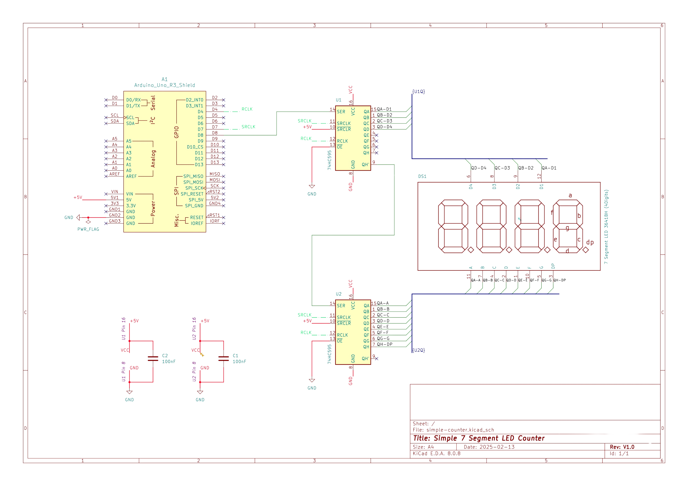
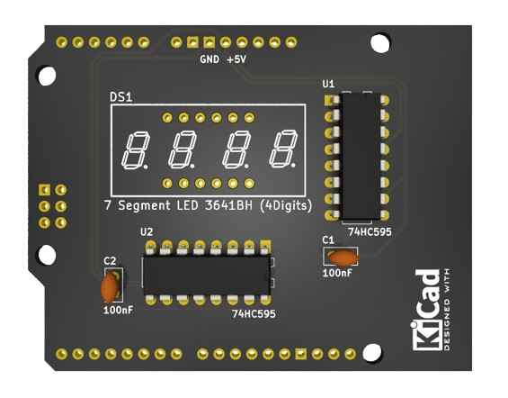
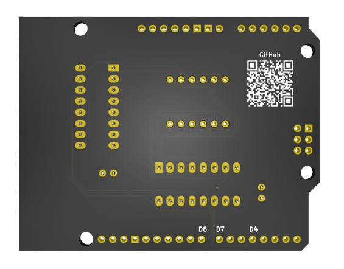

# Simple 7-Segment Display Controller

A Rust-based PlatformIO Arduino project for controlling a 4-digit 7-segment
display with incrementing counter functionality. The purpose of this project is
to develop a simple PCB, software, and case design as a template for developing
hardware devices from ideation to production.

## Features

- Efficient multiplexed display using 74HC595 shift registers
- Safe interrupt handling with Mutex
- Hardware abstraction layer for Arduino integration

## Circuit Diagram



## Breadboard Design


## PCB Design




# PCB Assembled


## Case Design


## Hardware Setup

- Arduino Uno R3
- 2x 74HC595 shift registers
- 4-digit 7-segment display (common cathode)
- 2x Ceramic capacitors (100nF)
- 1x 5-pin header for Arduino pins

## Prerequisites

- PlatformIO Core (CLI) or PlatformIO IDE
  ```bash
  cargo install cargo-pio
  ```
- Rust toolchain with AVR target:
  ```bash
  rustup override set nightly
  rustup target add avr-unknown-gnu-atmega328
  ```
- AVR-GCC toolchain
  ```bash
  sudo apt-get install -y gcc-avr binutils-avr avr-libc
  ```

## Install Dependencies

```bash
sudo apt-get install -y python3-venv # If not already installed
cargo install cargo-pio
```

## Building and Flashing

1. Clone the repository:

   ```bash
   git clone https://github.com/sephynox/simple-counter-rs
   cd simple-counter-rs
   ```

2. Build the project:

   ```bash
   cargo pio build
   ```

3. Flash the firmware to your Arduino Uno:

   ```bash
   cargo pio exec -- run --target upload
   ```

## How to Create a New Project

```bash
cargo pio new --board uno your-project-name
```

## License

This project is licensed under the MIT License - see the [LICENSE](LICENSE) file for details.
